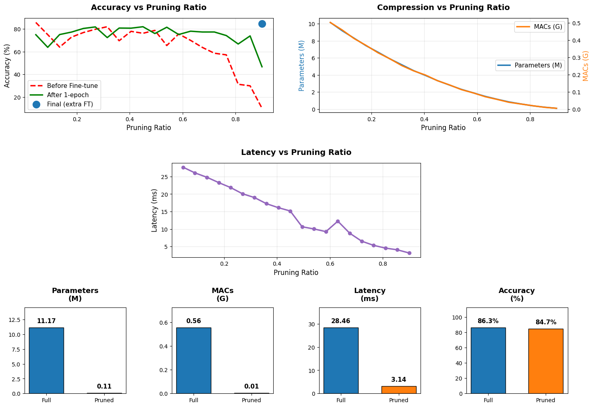

# ResNet-18 CIFAR-10 Pruning

I built this project for a "Introduction to Intelligent Control" course presentation with a topic of "Neural Networks Pruning".

The goal was to see how much I could compress a standard ResNet-18 model without completely destroying its accuracy. I used the [Torch-Pruning](https://github.com/VainF/Torch-Pruning) library to perform structural pruning, removing the least important filters based on their L2 norm.

## Key Results

| Metric | Original Model | Pruned Model | Change |
| :--- | :---: | :---: | :---: |
| **Accuracy** | 86.28% | **84.70%** | -1.58% |
| **Parameters** | 11.17 M | **0.11 M** | **-99%** |
| **FLOPs (MACs)** | 0.56 G | **0.01 G** | **-98%** |
| **Latency** | 28.46 ms | **3.14 ms** | **9x Faster** |



*(Run the notebook to generate this plot)*

## How it works

The project follows a standard "Train, Prune, Fine-tune" pipeline:

1.  **Train from Scratch:** First, I trained a ResNet-18 on the CIFAR-10 dataset to get a baseline accuracy of 86.28%.
2.  **Iterative Pruning:** I didn't prune everything at once. I set up a loop to prune the model in 20 steps, removing a small chunk of filters each time.
3.  **Fine-Tuning:**
    * After each pruning step, I retrained for 1 epoch to stabilize the model.
    * At the very end (when the model was tiny but accuracy had dropped to ~10%), I ran a final 10-epoch fine-tuning which brought the accuracy back up to 84.70%.

## How to Run

1.  **Clone the repo:**
    ```bash
    git clone [https://github.com/ivander11/resnet18-cifar10-pruning.git](https://github.com/ivander11/resnet18-cifar10-pruning.git)
    cd resnet18-cifar10-pruning
    ```

2.  **Install dependencies:**
    ```bash
    pip install -r requirements.txt
    ```

3.  **Run the Notebook:**
    Open `Neural_Network_Pruning.ipynb` in Jupyter or Google Colab and run all cells.

## References
* Course: Introduction to Intelligent Control
* Pruning Library: [Torch-Pruning](https://github.com/VainF/Torch-Pruning)
* Based on this [Medium Tutorial](https://medium.com/@arikpoznanski/neural-network-pruning-how-to-accelerate-inference-with-minimal-accuracy-loss-936cad741c2a) 
